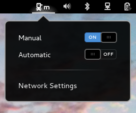

proxy-switcher
==============

A Gnome Shell Extension to switch the proxy mode between the pre-defined modes "none", "manual" and "automatic". The extension adds a button with dropdown to select the proxy mode to the Quick Menu like so:

The gnome extensions page is [here](https://extensions.gnome.org/extension/771/proxy-switcher/). Install using the [extensions website](https://extensions.gnome.org/extension/771/proxy-switcher/) or alternatively follow the manual installation instructions below.

Any contributions are very welcome (e.g. new features, translations, bug fixes etc) and I will consider all feature requests. Please submit an issue/pull request or email me at `tomflannaghan@gmail.com`.

## Installation

I recommend using the gnome extensions site but this is not always up to date. To get the latest version, do

    git clone https://github.com/tomflannaghan/proxy-switcher.git
    cd proxy-switcher
    make build
    make install

## Older Gnome versions

Current master branch only supports version 45. There have been breaking changes to the Gnome Shell API. The best way to download the appropriate version for your Gnome is via the [extensions website](https://extensions.gnome.org/extension/771/proxy-switcher/), where
you can select the shell version you would like.

There are branches for some older versions of Gnome, e.g. `gnome44` branch for Gnome 44.

## Translations

I have added the translations I found in the [`gnome-control-center`](https://git.gnome.org/browse/gnome-control-center) project to the extension (these are the translations used in the "Network Settings" menu). I've also used the "Network Settings" desktop shortcut to translate that phrase.
